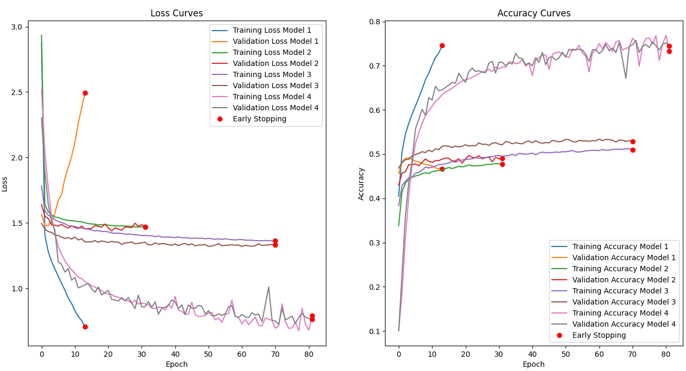
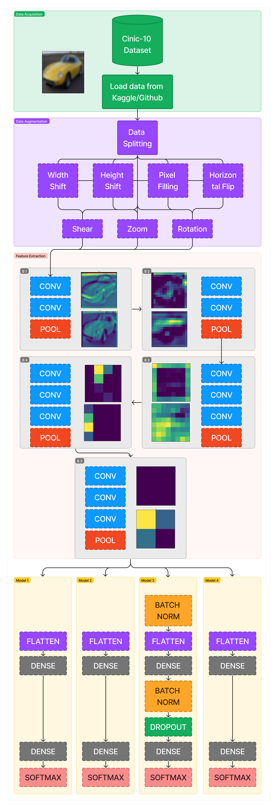
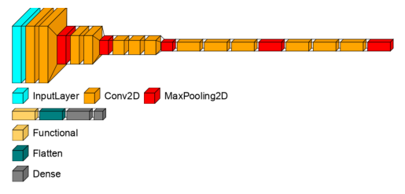
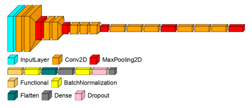

<!-- PROJECT -->
# Image Classification with Transfer Learning

<!-- ABOUT THE PROJECT -->

## About The Project
This repository, focuses on exploring the effectiveness of transfer learning in image classification tasks. By leveraging pre-trained models, specifically VGG networks, the goal was to utilize pretrained ConvNet models using transfer learning, which significantly improved the classification accuracy with minimal computational resources compared to training models from scratch. Though the accuracy achieved was 53.09% 

In my study, I used the VGG model with pretrained weights on [IMAGENET](https://www.image-net.org) and used a modified version of it to train on [CINIC-10](https://arxiv.org/abs/1810.03505). I experimented with various configurations of the VGG model to classify images across multiple categories. The findings, detailed in my research [paper](https://github.com/aditya-524/ImageClass_TL/blob/main/Image%20Classification%20with%20Transfer%20Learning.pdf) and [code](https://github.com/aditya-524/ImageClass_TL/blob/main/VGG_4_models.ipynb).

 Below are some of the results from the paper.

  

<!-- OVERVIEW -->
## Overview
  Transfer Learning Efficiency: Utilizing VGG pre-trained models allows for considerable improvements in accuracy.
  Model Comparison: Analysis of different VGG configurations to determine the most effective setup for our classification task.
  Performance Metrics: Evaluation of models based on accuracy, precision, and recall metrics.

<!-- FLOWCHART -->
## General Flowchart for the project 

  

<!-- REIMPLEMENTATION -->
## Implementing
The project is implemented using a jupyter notebook, so its fairly straightforward to download it directly to retest. [Notebook]()
I used 4 versions of the models 
1. VGG16 model with untrainable Convolutional layers and replacing the classifier with a flatten layer, dense layer with Relu activation and output layer with Softmax activation function

2. The configuration is the same as model 1, in addition to that we introduce data augmentation for training the model

3. The configuration is the same as model 1, in addition to that we introduce data augmentation for training and regularization methods such as Batch Normalization and Dropout Layer

4. VGG16 model with fully trainable weights and replacing the classifier with a flatten layer, dense layer with Relu activation and output layer with Softmax activation function.

<!-- Dependencies -->
## Dependencies

The code utilizes the python packages as such 
* matplotlib, 
* VisualKeras, 
* pickle, 
* numpy, 
* scikit-learn,
* Tensorflow.

<!-- LICENSE -->
## License
Distributed under the MIT License. See `LICENSE` for more information.

<!-- Authors -->
## Authors
Project Link:[Project](https://github.com/aditya-524/ImageClass_TL)
 ~~Kaggle Notebook:~~ 
 ~~Collab Notebook:~~ 

## Thank you

<picture>
  <source media="(prefers-color-scheme: dark)" srcset="https://user-images.githubusercontent.com/25423296/163456776-7f95b81a-f1ed-45f7-b7ab-8fa810d529fa.png">
  <source media="(prefers-color-scheme: light)" srcset="https://user-images.githubusercontent.com/25423296/163456779-a8556205-d0a5-45e2-ac17-42d089e3c3f8.png">
  
</picture>

> [!NOTE]
> I did not conduct hyperparameter tuning of the model, which is an essential step for achieving good accuracy.
